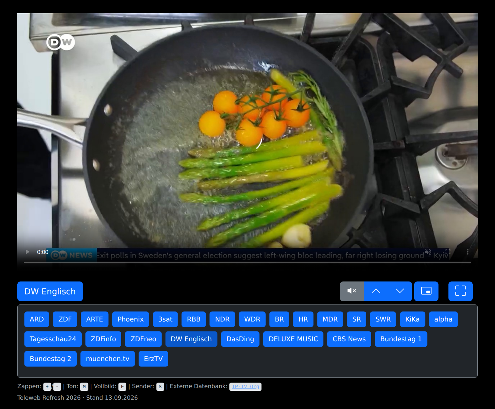

## Teleweb
Teleweb ist eine schlichte Internetseite, die den einfachen (Mobilgeräte-optimierten) Zugriff auf das Live-Programm der Öffentlich-Rechtlichen und eine Handvoll frei empfangbarer Privat- und Auslandssender ermöglicht. Die Bild-in-Bild-Funktion steht in Chrome, Edge und Safari (iPad/Mac) zur Verfügung. Der zuletzt gesehene Sender wird gemerkt und beim nächsten Besuch automatisch wieder gestartet.

### Demo
- Eine aktuelle Live-Version lässt sich auf [https://telemat.1mb.site/](https://telemat.1mb.site/) begutachten.

### Bedienung
- **Sender** öffnet die Senderliste, die Pfeiltasten schalten einen Sender weiter bzw. zurück.
- Der Player startet stummgeschaltet (Autoplay-Regel der Browser); der Lautsprecher-Knopf schaltet den Ton ein.
- Medientasten (Tastatur, Kopfhörer, Sperrbildschirm) für „nächster/vorheriger Titel“ zappen ebenfalls durch die Sender.

#### Hotkeys
Steht eine Tastatur zur Verfügung, lässt sich zwischen den Sendern mit den Tasten „+/-“ zappen, die Taste „M“ schaltet den Ton ein bzw. stumm, die Taste „F“ startet und verlässt die Vollbildansicht, die Taste „S“ öffnet und schließt die Senderliste. Tastenkombinationen mit Strg/Cmd/Alt werden nicht abgefangen.

### Senderliste
| Gruppe | Sender |
| --- | --- |
| Öffentlich-Rechtliche | ARD, ZDF, ARTE, Phoenix, 3sat, RBB, NDR, WDR, BR, HR, MDR, SR, SWR, KiKa, alpha, Tagesschau24, ZDFinfo, ZDFneo |
| Auslandssender | DW Englisch, CBS News |
| Sonstige | DasDing, DELUXE MUSIC, Bundestag 1+2, muenchen.tv, ErzTV |

Die meisten Streams der Öffentlich-Rechtlichen sind **geo-gesperrt**: Außerhalb Deutschlands antworten sie mit „403 Access Denied“ oder leiten auf eine internationale Variante mit eingeschränktem Programm um (z.&nbsp;B. ARD, NDR, WDR, BR, HR, KiKa). Die Bundestag-Streams laufen nur während der Sitzungen und liegen derzeit nur in 480p vor.

Die Senderliste steht als einfaches Objekt am Anfang der `index.html` und lässt sich dort direkt bearbeiten; die Reihenfolge der Einträge bestimmt die Reihenfolge der Knöpfe und der Zapp-Reihenfolge. Weitere Streams findet man z.&nbsp;B. bei [iptv-org](https://iptv-org.github.io/).

#### Sender prüfen
`./sender-check.sh` ruft jede Stream-URL aus der `index.html` per `curl` ab und meldet den HTTP-Status. Ein 403 ist wegen der Geo-Sperren nur aus Deutschland heraus aussagekräftig. Das Skript endet mit Exit-Code 1, sobald ein Stream nicht mit 200 antwortet.

### Technik
Eine einzelne `index.html` ohne Build-Schritt: [Bootstrap 5](https://getbootstrap.com/) und [hls.js](https://github.com/video-dev/hls.js) kommen per CDN (versionsgepinnt, mit Subresource Integrity), die Bedienlogik ist reines JavaScript ohne weitere Abhängigkeiten. Safari und iOS nutzen ihre native HLS-Wiedergabe, alle anderen Browser hls.js. Ist keiner der beiden Wege verfügbar (etwa weil das CDN nicht erreichbar ist), zeigt die Seite einen Hinweis statt still zu scheitern.
